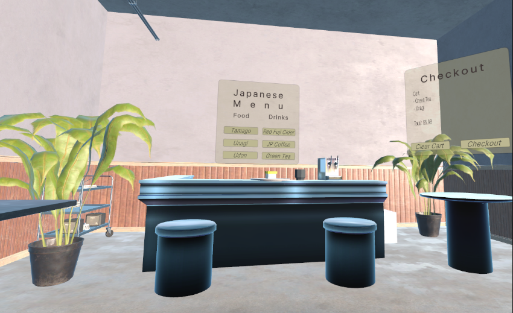

# Input² — VR Restaurant Menu System

## Project Overview

Input² is an immersive Virtual Reality (VR) restaurant menu system designed for exploring how **3D food visualization and hand-tracked interaction** influence user decision-making, usability, and confidence in a dining context.

Users can interact with realistic 3D food models inside a virtual restaurant environment, inspect them from multiple angles, and add items to a virtual cart using intuitive hand-based interactions.

---

## Demo Videos

### Project Overview
- YouTube: https://youtu.be/YLKQnXrkQh0  
- Download: https://drive.google.com/file/d/1xgyTHY8Z2gB6VL4YVhkEk9SkqI5N4qw9/view?usp=sharing  

### Project Presentation
- YouTube: https://www.youtube.com/watch?v=vuaz42zJuJw  
- Download: https://drive.google.com/file/d/1xXTo2vYHSBmcCFanIR73PAZLmdpRSDij/view?usp=sharing  

### Programming Breakdown
- YouTube: https://www.youtube.com/watch?v=TeoqBNLaQF8  
- Download: https://drive.google.com/file/d/1fxQpc-eh2ydRJrVVeLZ5eTBE2f1_T-C2/view  

---

## GitHub Repository

https://github.com/csu-hci-projects/SP26-Input2

---

## Requirements

### Unity Version
- **Unity 6000.3.11f1 or later**

### Hardware
- Meta Quest 3 / Quest-compatible headset
- PC with Meta Horizon Link / Link support enabled

### Software Dependencies
- Unity XR Interaction Toolkit
- Meta XR SDK (for hand tracking and headset integration)

---

## How to Run the Project

### 1. Clone or Download the Repository
Download or clone the project from GitHub and open it in Unity Hub.

### 2. Open in Unity Hub
- Add the project folder in Unity Hub
- Open using Unity **6000.3.11f1 or later**
- Allow all packages to finish importing

### 3. Load the Scene
Navigate to:

Open the scene.

### 4. Connect VR Headset
- Launch **Meta Horizon Link**
- Connect your Quest device
- Ensure the device appears under **Devices**
- Put on the headset once connection is confirmed

### 5. Enter Play Mode
- Press the **Play button** in Unity
- The VR environment will launch in the headset or via Link

---

## How to Use the System

### Interaction Overview
- Use **hand tracking** to interact with UI elements and objects
- Spawn food and drink items from the UI menu
- Grab and inspect 3D food models in space

### Menu System
- Use canvas UI menus to:
  - Spawn food/drink prefabs
  - Select and inspect items

### Cart System
- Drag food items into checkout zones to add them to the cart
- Use:
  - **Clear Cart** → removes all items
  - **Checkout** → finalizes selection

---

## Ending a Session

To stop the experience:
- Exit Play Mode in Unity (stop button), OR
- Proceed to checkout and exit through the in-game exit door

---

## Project Structure (High Level)

- `Assets/` — Main Unity project assets
- `Scenes/Input2_restaurant.unity` — Main VR experience scene
- `Prefabs/` — Food and interaction objects
- `Scripts/` — Interaction, cart, and UI logic
- `XR/` — XR Interaction Toolkit components and settings

---

## Authors

- Courtney Malone  
- Enock Apedjinou  
Colorado State University
---

## Notes

- Designed for seated or standing VR use
- Best experienced with hand tracking enabled
- Performance may vary depending on hardware setup

---
